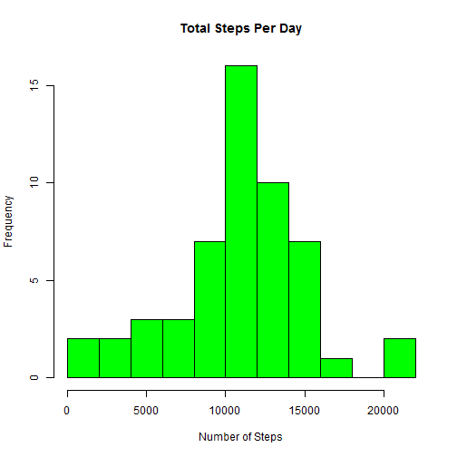
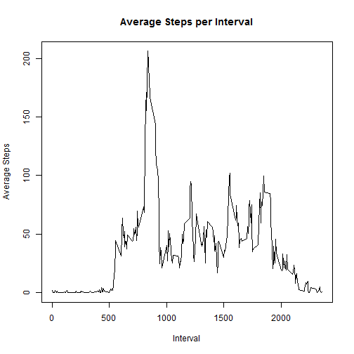
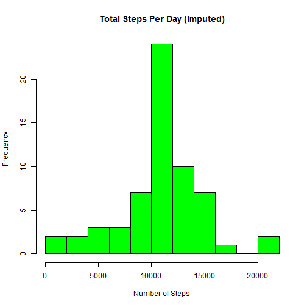
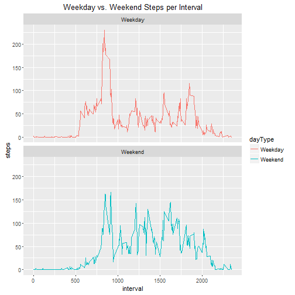

### Reproducible Research Assignment 1

#### Introduction:

This assignment makes use of data from a personal activity monitoring device. This device collects data at 5 minute intervals through out the day. The data consists of two months of data from an anonymous individual collected during the months of October and November, 2012 and include the number of steps taken in 5 minute intervals each day.

#### Loading and Presenting the Data
Show any code that is needed to:

1. Load the data i.e.( read.csv())  
2. Process/transform the data (if necessary) into a format suitable for analysis  


```r
# Ensure that your working directory is set to the location of the csv file!
activity <- read.csv("activity.csv", stringsAsFactors=FALSE)
# Change the dates from character to date format for easier manipulation as dates
activity$date <- as.Date(activity$date)
```

#### What is mean total number of steps taken per day?
For this part of the assignment, you can ignore the missing values in the dataset.

1. Calculate the total number of steps taken per day
2. If you do not understand the difference between a histogram and a barplot, research the difference between them. Make a histogram of the total number of steps taken each day
3. Calculate and report the mean and median of the total number of steps taken per day


```r
stepsDay <- aggregate(steps ~ date, activity, sum)
hist(stepsDay$steps, breaks=15, col="green", main="Total Steps Per Day", xlab="Number of Steps")
```



```r
meanAll <- mean(stepsDay$steps)
medianAll <- median(stepsDay$steps)
```

The mean for the total number of steps per day is: 1.0766189 &times; 10<sup>4</sup>

The median for the total number of steps per day is: 10765


#### What is the average daily activity pattern?
1. Make a time series plot (i.e. type = "l") of the 5-minute interval (x-axis) and the average number of steps taken, averaged across all days (y-axis)
2. Which 5-minute interval, on average across all the days in the dataset, contains the maximum number of steps?


```r
stepsInt <- aggregate(steps ~ interval, data=activity, FUN=mean)
plot(stepsInt$interval, stepsInt$steps, type="l", main="Average Steps per Interval", 
     xlab="Interval", ylab="Average Steps")
```



```r
maxInt <- stepsInt[which.max(stepsInt$steps), 1]
```

The 835th interval contains the maximum number of steps

#### Imputing missing values

Note that there are a number of days/intervals where there are missing values (coded as NA). The presence of missing days may introduce bias into some calculations or summaries of the data.

1. Calculate and report the total number of missing values in the dataset (i.e. the total number of rows with NAs)
2. Devise a strategy for filling in all of the missing values in the dataset. The strategy does not need to be sophisticated. For example, you could use the mean/median for that day, or the mean for that 5-minute interval, etc.
3. Create a new dataset that is equal to the original dataset but with the missing data filled in.
4. Make a histogram of the total number of steps taken each day and Calculate and report the mean and median total number of steps taken per day. Do these values differ from the estimates from the first part of the assignment? What is the impact of imputing missing data on the estimates of the total daily number of steps?

The strategy for replacing missing values is to replace them with the average for that 5-minute interval.  


```r
totalNA <- sum(is.na(activity))
imputeAct <- activity
#create a table with the average number of steps per 5-minute interval using tapply
avgInt <- tapply(imputeAct$steps, imputeAct$interval, mean, na.rm=TRUE)
nas <- is.na(imputeAct$steps)
#replace the missing value with the average number of steps for that interval
imputeAct$steps[nas] <- avgInt[as.character(imputeAct$interval[nas])]

stepsDayImp <- aggregate(steps ~ date, imputeAct, sum)
hist(stepsDayImp$steps, breaks=15, col="green", main="Total Steps Per Day (Imputed)", xlab="Number of Steps")
```



```r
meanImp <- mean(stepsDayImp$steps)
medianImp <- median(stepsDayImp$steps)
```

The total number of missing values is: 2304

After imputing missing values:  
The mean for the total of steps per day is: 1.0766189 &times; 10<sup>4</sup>  
The median for the total steps per day is: 1.0766189 &times; 10<sup>4</sup>  

Imputing the missing values makes the mean and median equal. Otherwise there is little overall difference between imputing the missing values and not doing so.  


#### Are there differences in activity patterns between weekdays and weekends?
For this part the weekdays() function may be of some help here. Use the dataset with the filled-in missing values for this part.

1. Create a new factor variable in the dataset with two levels - "weekday" and "weekend" indicating whether a given date is a weekday or weekend day.
2. Make a panel plot containing a time series plot (i.e. type = "l") of the 5-minute interval (x-axis) and the average number of steps taken, averaged across all weekday days or weekend days (y-axis). See the README file in the GitHub repository to see an example of what this plot should look like using simulated data.


```r
weekend <- c("Saturday", "Sunday")
imputeAct$dayType <- as.factor(ifelse(weekdays(imputeAct$date) %in% weekend, "Weekend", "Weekday"))
imputeDiff <- aggregate(steps ~ interval + dayType, data=imputeAct, FUN=mean)

library(ggplot2)
g <- ggplot(imputeDiff, aes(x=interval, y=steps, color=dayType)) +
        geom_line() +
        facet_wrap(~dayType, nrow=2, ncol=1) +
        labs(title = "Weekday vs. Weekend Steps per Interval")
print(g)
```



On weekdays, there is a higher peak in activity during the first half of the day.  However, there is overall more activity on weekends.
